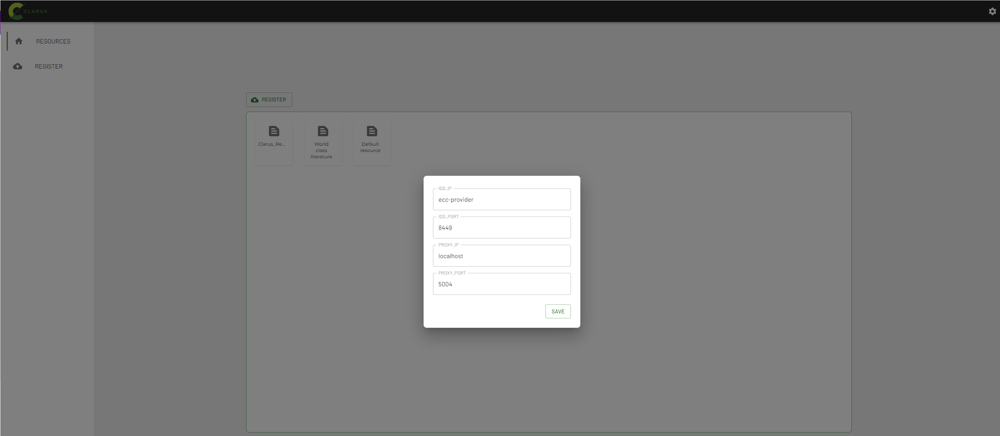

# clarus_edge_deploy

This repository contains the docker-compose and the configuration files needed to deploy the clarus edge services related with the AI lifecycle and data sharing through an IDS clarus dataspace.
Currently, all the services are based on docker images located in public docker registries and in DockerHub project repository.

## Requirements

- Linux machine with Docker version 23.0.5 or above
- Linux machine with Docker-compose version 1.29.2 or above

## Getting started

- Clone this repository.
- Move to the folder clarus_edge_deploy
- Edit .env file and set the PROVIDER_MODEL_CLOUD_IP property with the IP where the aitoolkit connector has been deployed.
- Login in Dockerhub using the clarusproject credentials provided by ENG
- Execute docker-compose file
```
docker-compose up -d
```

## How to use

Once docker-compose is finished, all the containers shall be up and running. To check it, write in terminal type in terminal
```
docker ps -a
```
You shall see the next services:
```
adeptness@21310-1166:~/Clarus/clarus_edge_deploy$ docker ps -a
CONTAINER ID   IMAGE                                             COMMAND                  CREATED          STATUS                             PORTS                                                                    NAMES
2e276eec6e3f   clarusproject/clarus_webserver_data_app:0.0.1     "/bin/sh -c 'java -j…"   26 seconds ago   Up 21 seconds (health: starting)   0.0.0.0:8083->8083/tcp, 0.0.0.0:9000->9000/tcp                           be-dataapp-provider
768afd6e9907   clarusproject/clarus_proxy:0.0.1                  "docker-entrypoint.s…"   26 seconds ago   Up 22 seconds                      0.0.0.0:5000->5000/tcp                                                   clarus-proxy
d60f179c8c0b   clarusproject/clarus_hmi:0.0.1                    "docker-entrypoint.s…"   26 seconds ago   Up 22 seconds                      0.0.0.0:3000->3000/tcp                                                   clarus-hmi
a040a91114c0   rdlabengpa/ids_uc_data_app_platoon:v1.5           "/bin/sh -c 'java -j…"   26 seconds ago   Up 22 seconds                      8080/tcp                                                                 uc-dataapp-provider
83e7b90c76c6   rdlabengpa/ids_execution_core_container:v1.11.0   "/bin/sh -c 'java -j…"   26 seconds ago   Up 22 seconds (health: starting)   0.0.0.0:8086->8086/tcp, 0.0.0.0:8889->8889/tcp, 0.0.0.0:8090->8449/tcp   ecc-provider
710fbc5e3640   clarusproject/clarus_agent:0.0.1                  "python3 app.py"         26 seconds ago   Up 22 seconds                      0.0.0.0:8082->8082/tcp                                                   clarus-agent
7ce63b68bd31   clarusproject/clarus_inference:0.0.1              "python3 main.py"        26 seconds ago   Up 21 seconds                      0.0.0.0:7040->7040/tcp                                                   clarus-inference
```

Use your Internet browser to access Clarus User interface  available at port 3000 
```
http://EdgeDeploy_IP:3000
```


Currently, some configuration settings are needed. Click in the upper right icon and  set the PROXY_IP with the Ip where the edge services have been deployed.



Then, click in the resources menu and the resources already registered in the connector will apper in the canvas. By default you will see two resources that will be deleted in later versions.

New resources can be added with the Register menu 


- Filename: Name for the dataset. This name will be used by the AIToolkit to create and train the model and also to register the trainned model in the trainning connector. ()

- Catalog: An IDS connector can have multiple catalogs. It is assumed that the resources will be registered in the default catalogue raised by the connector.

- Type: Select the data source.This version of the edge services expects the datasets to be hosted on web servers. Later versions will be able to access other types of storage. 

- Path: Path of the dataset on the web server.
  
AItoolkit has by default an experiment for wine quality. As an example and to test the complete cycle register-train-download model-execute inference, you can register 
- Filename:Clarus_RedWine_experiment
- Path:http://archive.ics.uci.edu/ml/machine-learning-databases/wine-quality/winequality-red.csv

Once the dataset has been trainned with AItoolkit, you can download the best inference model and execute it making use of Postman tool (a ClarusHE.postman_collection.json & ClarusHE enviroment.postman_environment.json  are provided) or any other Rest Client.


## TrueConnector documentation
A complete description of TrueConnector can be found [here](https://github.com/Engineering-Research-and-Development/true-connector)


